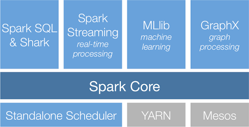

# 개요

- 빅데이터와 관련된 프레임워크인 하둡과 스파크에 대해 알아보자

# 하둡 (HADOOP) 

### 하둡이란

- 대용량 데이터를 분산 처리할 수 있는 자바 기반의 오픈소스 프레임 워크이다.
- 하둡은 여러 대의 서버에 데이터를 저장하고, 저장된 각 서버에 동시에 데이터를 처리하는 방식이다.
- 큰 데이터를 처리하기에 기존 방식이 너무 비싸기 때문에 등장하게 되었다.

### 하둡의 장점

1. 대용량 파일을 저장할 수 있는 분산 파일 시스템을 제공한다.
2. 데이터 베이스는 하드웨어 추가 시 성능 향상이 선형적이지 않은 반면에, 하둡은 장비를 증가시킬수록 성능 향상이 선형적이다.
3. 무료이다.

### 하둡의 핵심 기능

- 하둡의 핵심 기능은 맵리듀스(MapReduce) 프레임워크 / 분산형 파일시스템(HDFS)이다.

- HDFS에 데이터를 저장하고, 맵리듀스를 이용해 데이터를 처리한다.

  - **맵리듀스(MapRedude)**

    - 구글에서 대용량 데이터 처리를 분산 병렬 컴퓨팅에서 처리하기 위한 목적으로 제작한 소프트웨어 프레임워크이다.

    - 사용자가 Map과 Reduce 두 함수를 이용하여 데이터를 처리하도록 한다.
      1. 데이터를 Key와 Value 형태로 연관성있는 데이터로 분류한다.(Map)
      2. 중복데이터를 제거하고 원하는 데이터를 추출한다.(Reduce)

  - **분산형 파일시스템(HDFS)**

    - 수십 테라바이트 또는 페타바이트 이상의 대용량 파일을 분산된 서버에 저장하고, 그 저장된 데이터를 빠르게 처리할 수 있게 하는 파일시스템이다.

    - 저사양 서버를 이용해서 스토리지를 구성할 수 있어 기존의 대용량 파일 시스템등에 비해 장점을 가진다.

      

# 스파크(SPARK)

### 스파크란?

- 스파크는 오픈 소스 클러스터 컴퓨팅 프레임워크이다. (범용적 목적의 분산 고서능 클러스팅 플랫폼)

### 스파크의 등장 이유

- 빅데이터 = 하둡이라는 생각을 했은 만큼 하둡의 등장은 엄청났으나, HDFS의 디스크 I/O 방식은 데이터를 빠르게 처리할 수 없다는 문제점이 있었다.  => 인메모리 기반 데이터 프로세싱의 필요성
    - DISK 기반 데이터 처리의 문제점
        - 데이터 처리 시간 외에도 read/write 연산에 추가 시간 소요된다.
        - 반복 쿼리 작업 수행 시 중간 결과물도 DISK에 read/write 반복된다.
        - 동일 Data에 대해서 작업할 때, 매번 Read 연산이 필요하다.
- 또한 HW 가격의 인하로, 서버에 메모리를 고용량으로 장치할 수 있게 되었다. 그로 인해 인메모리 상에서 스트림처리를 효과적으로 수행하고, 병렬처리를 쉽게하며 머신러닝의 요구사항 마저 수용할 수 있는 스파크가 대세로 떠오르고 있다.

### 스파크의 특징

- **인메모리 기반의 빠른 처리**
    - 인메모리 기반 데이터 처리의 장점
        - 단계-단계 사이에 read/write 작업이 사라졌다.
        - 매 쿼리때마다 input을 처음부터 read해왔던 문제가 사라졌다.
    - 스파크는 인메모리 기반의 처치로 맵리듀스 작업처리에 비해 디스크는 10배, 메모리 작업은 100배 빠른 속도를 가지고 있다.
    - 맵리듀스는 작업의 중간 결과를 디스크에 쓰기 때문에 IO로 인하여 작업 속도에 제약이 생기는 반면에, 스파크는 메모리에 중간 결과를 저장하여 반복 작업의 처리 효율이 높다.
- **다양한 언어 지원**
    - 스파크는 자바, 스칼라, 파이썬, R 인터페이스등 다양한 언어를 지원하여 개발자에게 작업의 편의성을 제공한다.
    - 하지만 언어마다 처리하는 속도가 달라서, Scala로 개발하는 것을 추천하고 있다. (거의 필수라고 여겨짐)
    - 스파크 성능이 안나오면, 먼저 어떤 언어로 짰는지 확인해보는 것이 좋다. (스칼라로 코딩한 것과 파이썬으로 코딩한 것의 성능차이는 엄청나다.)
- **다양한 클러스터 매니저 지원**
    - 클러스터 매니저로 YARN, Mesos, Kubernetes, Standalone등 다양한 포맷을 지원하여 운영 시스템 선택에 다양성을 제공한다.
    - HDFS, 카산드라, HBase, S3등의 다양한 데이터 포맷을 지원하여 여러 시스템에 적용이 가능하다.
- **다양한 컴포넌트 제공**
    - 스파크는 단일 시스템 내에서 스파크 스트리밍을 이용한 스트림 처리, 스파크 SQL을 이용한 SQL 처리, MLib을 이용한 머신러닝 처리, GraghX를 이용한 그래프 프로세싱을 지원한다. 추가적인 소프트웨어의 설치 없이도 다양한 애플리케이션을 구현할 수 있고, 각 컴포넌트 간의 연계를 이용한 애플리케이션의 생성도 쉽게 구현 할 수 있다.

### 스파크의 컴포넌트 구성

- 스파크 컴포넌트 구성은 스파크 라이브러리, 스파크 코어, 클러스터 매니저로 구분되어 있다.
- 
- **스파크 코어(Spark Core)**
    -  Spark Core는 메인 컴포넌트 작업 스케줄링, 메모리 관리, 장애 복구와 같은 기본적인 기능을 제공하고, RDD Dateset, DataFrame을 이용한 스파크 연산을 처리한다.
- **스파크 라이브러리 (Spark Library)**
    - Spark SQL
        - SQL을 이용하여 RDD, DateSet, DataFrame 작업을 생성하고 처리한다.
    - Spark Streaming
        - 실시간 데이터 스트림을 처리하는 컴포넌트이다.
    - MLib
        - 스파크 기반의 머신러닝 기능을 제공하는 컴포넌트이다.
    - GraphX
        - 분산형 프로세싱이 가능하게 해주는 컴포넌트이다. 각 간선이나 점에 임의의 속성을 추가한 지향성 그래프를 만들 수 있다.
- **클러스터 매니저 (Cluster Manger)**
    - 스파크 작업을 운영하는 클러스터 관리자이다. 스파크는 다양한 클러스터 매니저를 지원한다. 스파크에서 제공하는 Standardalone 관리자를 이용하거나, Yarn, Mesos, Kubernetes 등의 관리자를 지원한다.

### 로그 수집 서버에 스파크 적용?

- 실질적으로 현재 개발하는 로그 서버에 적용시키면 낭비라고 생각된다.
  - 낭비라는 생각하는 이유
    - 분산 컴퓨팅이기 때문에 유로 클라우드 모델을 사용해야한다.
    - 스파크를 사용해야 될 정도로 데이터의 양이 많지 않다.
    - 스파크는 대용량 데이터를 처리하는 포탈 회사, 자율주행자동차, 게임 회사에서 많이 쓰인다.
- 넥슨의 듀랑고를 만든 팀의 데이터 분석가들을 AWS ERM을 사용했는데, 이유는 한달에 5TB의 로그가 쌓이기 때문에 빠르게 처리하기 위해서 도입했었다.
  - ​	AWS ERM이란?
    - https://aws.amazon.com/ko/emr/features/
    - 빅 데이터 환경 및 애플리케이션을 간단하게 구축하고 운영할 수 있는 운영 툴
    - 즉, HDFS, S3와 같은 데이터 스토어와 Apache, Spark과 같은 하둡 도구들을 지원해줌

# 하둡 vs 스파크

- 하둡과 스파크는 실질적인 경쟁대상이 아니다.
- 대부분 하둡과 스파크를 같이 사용하는 것을 권장한다.
- 하둡은 HDFS로써 데이터 저장소 역할을 하고, Spark는 분석 엔진의 역할을 한다. (개념을 확실히 이해하는게 중요하다 !!)

# 결론

- 스파크와 하둡은 빅데이터와 관련하여 중요한 프레임워크이다.

- 내가 현재 개발하고 있는 로그 수집 서버에 데이터의 양이 엄청 쌓이게 된다면, 꼭 도입해야 되는 프레임워크라고 생각한다.

  