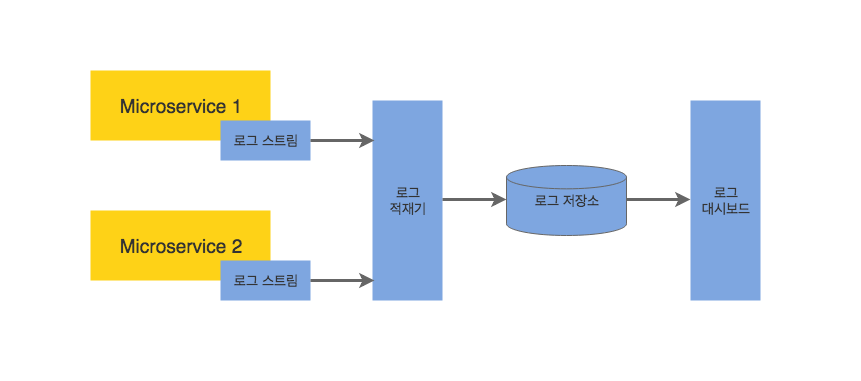
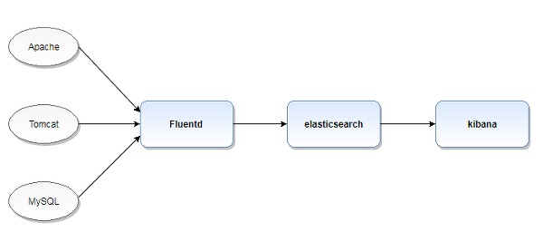
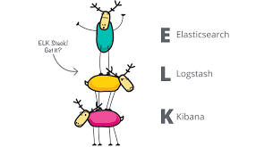
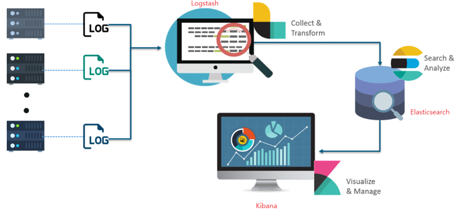
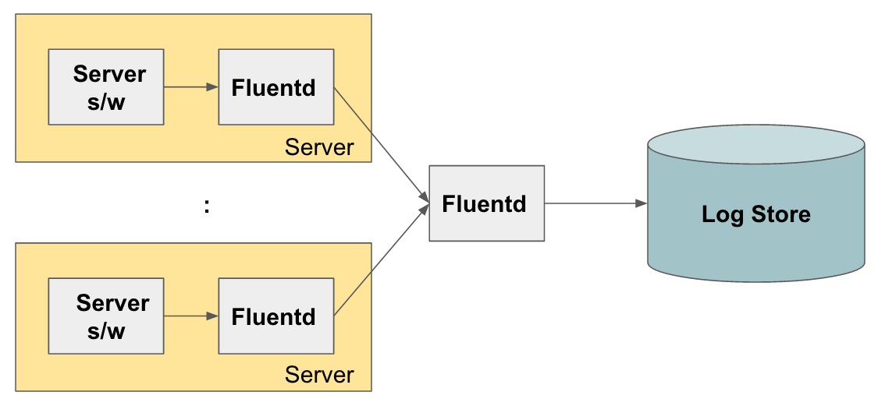
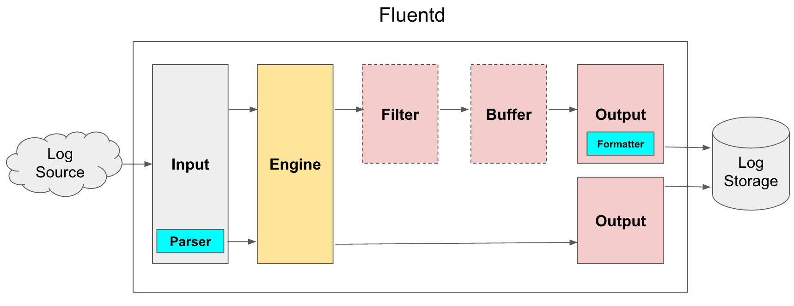

# 로그 분석 서버 설계

## 집중형 로그 서버 아키텍쳐

- 

- 로그 스트림(log stream) : 로그 생성자가 만들어내는 로그 메세지의 스트림(자바 기반에서 Log4j 로그스트림, nodejs에서 winston && morgan)	
- 로그 적재기 (log shipper): 메세지를 데이터베이스에 쓰거나, 대시보드에 푸시, 스트림 처리 종단점으로 보내는 등 여러 다른 종단점으로 메세지를 전송 
  - ex) Logstash, Fluentd	
- 로그 저장소(log store): 로그 메세지를 저장을 위한 대용량 데이터 저장소
  - Ex) HDFS, Elasticsearch, NoSQL
- 로그 대시보드(log dashboard): 로그 분석 결과를 시각화함
  - Ex) Kibana, Graphite

### EFK (Elasticsearch, Fluentd, Kibana) STACK

- 

- 로그 서버를 구축할 때 가장 많이 쓰이는 컴포넌트 조합이다.
  - 로그 적재기(log shipper): **Fluentd**(https://docs.fluentd.org/)
    - 가장 많이 사용되는 **Fluentd**는 로그 파일을 수집하고 적재하는데 사용할 수 있는 가장 강력한 파이프라인 도구이다.
    - 각 서비스에서 저장소로 바로 전달하지 않고 중간에 Fluentd를 넣는 이유는 Fluentd가 앞에서 들어오는 로그들을 수집하고 저장소에 넣기 전 트래픽을 Throttling(조절)해서 로그 저장소의 용량에 맞게 트래픽을 조정 할 수 있다.
    - 로그의 종류에 따라서 각각 다른 로그 저장소로 라우팅하거나 여러개의 저장소에 저장할 수 있다.
  - 로그 저장소: **Elasticsearch**
    - 실시간 로그 메세지는 일반적으로 **Elasticsearch** 에 저장된다. Elasticsearch를 사용하면 클라이언트가 텍스트 기반 인덱스를 바탕으로 쿼리할 수 있다.
    - 이외에도 HDFS는 일반적으로 아카이브된 로그 메세지를 저장하는데 사용된다.
    - MongoDB는 매월 집계되는 트랜잭션의 수와 같은 요약 데이터를 저장하는데 사용된다.
      - 트랜젝션(Transaction)이란 데이터베이스의 상태를 변화시키기 위해서 수행되는 작업의 단위를 뜻한다.
      - 간단하게 말해서 질의어를 통해 데이터베이스를 접근하는 것을 의미힌다.
  - 대시보드: **Kibana**
    - Elasticsearch 데이터 스토어를 기반으로 사용되는 Kibana가 자주 쓰인다.

### ELK (Elasticsearch, LogStash, Kibana) STACK

- 

- 
- EFK와 더불어서 로그 수집서버에서 많이 쓰는 수집 아키텍쳐
- 로그 적재기에서 Fluentd 대신에 logStash를 쓴다.

### Fluentd

- 서버에서 로그를 수집해서 중앙 로그 저장소로 전송하는 방식이다.
- 각 서버에, Fluentd를 설치하면, 서버에서 가동되고 있는 서버에서 로그를 수집해서 중앙 로그 저장소로 전송하는 방식이다.
- 각 서버에서 수집한 로그를 다른 Fluentd로 보내서 이 Fluentd가 최종적으로 로그 저장소에 저장하도록 할 수 있다.
- 

### Fluentd 내부 구조 

### (출처: https://bcho.tistory.com/1115?category=431297)

- 

- Input

  - 로그를 수집하는 플러그인으로, 다양한 로그 소스를 지원한다. HTTP, tail, TCP 등 기본 플러그인 이외에도, 확장 플러그인을 통해 다양한 서버나 애플리케이션으로 부터 다양한 포맷의 데이터를 수집할 수 있게 해준다.

- Parser(Optional)

  - Apache, nginx, syslog 등 다양한 포맷의 데이터를 파싱할 수 있는 플러그인을 제공한다.

- Filter(Optional)

  - 특정 데이터만 output 필드로 보내고, 나머지는 버리도록 한다. (Ex) 특정 패턴이 있을 경우만 로그 저장소로 보내도록 한다.

- Output

  - input 플러그인과 반대로 앞에서 필터링 된 데이터를  데이터 저장소에 저장하도록 한다.

- Formatter(Optional)

  - Output 플러그인을 통해서 데이터를 저장소에 쓸 때, Formatter를 이용하면 데이터 포맷을 정의할 수 있다.

- Buffer(Optional)

  - Input에 들어온 데이터를 바로 Output으로 보내서 쓰는 것이 아니라 중간에 선택적으로 Buffer를 둬서 Throttling을 할 수 있다.

    

### **Elasticsearch**

- 아파치 루씬 기반의 Java 오픈소스 분산 검색 엔진이다.
- Elasticsearch를 통해 루씬 라이브러리를 단독으로 사용할 수 있게 되었으며, 방대한 양의 데이터를 신속하게, 거의 실시간( NRT, Near Real Time )으로 저장, 검색, 분석할 수 있다.

### **Kibana** 